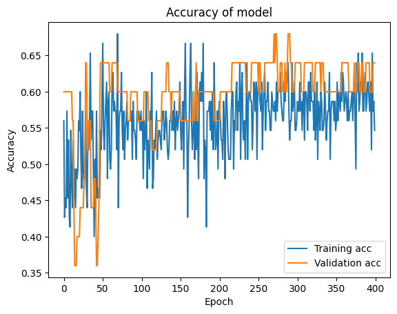
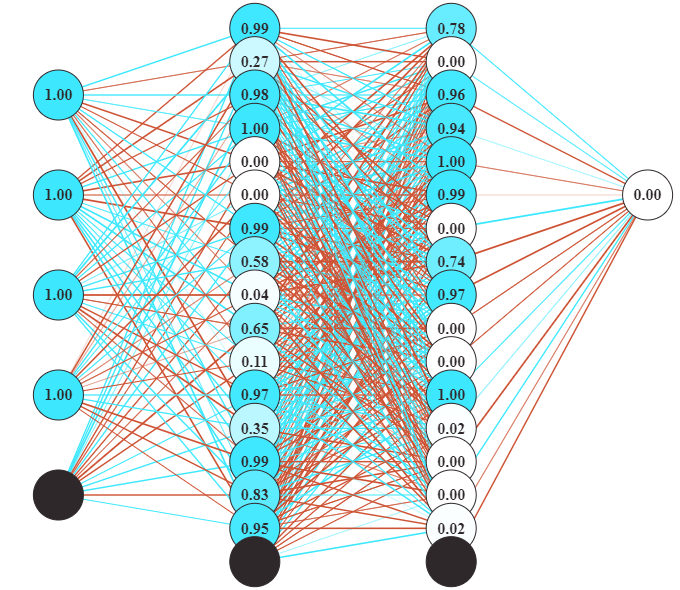
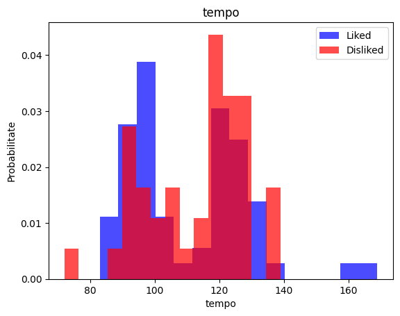
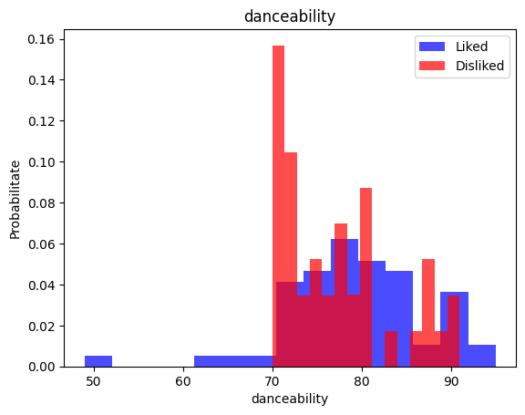
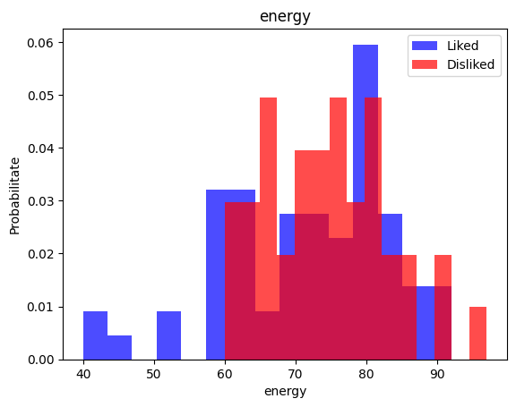
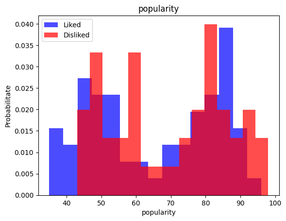

# Utilify
*creat de Soiu Cristian-Ionuț*

### Problema

În timpul evenimentelor cu public numeros, a spectacolelor sau a petrecerilor, în general este folosită muzica pentru un efect de bunăstare.
În general o persoană este desemnată ca animator muzical, inginer de sunet, sau, mai general, DJ. Acesta are mereu responsabilitatea de a se adapta la gusturile muzicale ale publicului, oferind astfel o experiență plăcută.
Unul dintre cele mai mari impasuri este selecția melodiilor, în general greoaie. Un DJ în medie are în biblioteca sa aproximativ **500 de piese**.
Pe parcursul unei sesiuni acesta este constrâns la maxim **2 minute** de a alege și a mixa următoarea melodie.

### Soluția

Utilify **automatizează** procesul de alegere a pieselor, astfel mărind timpul alocat mixării. Pe lângă oferă și avantajul faptului că dacă o melodie nu se află până în acel moment în biblioteca utilizatorului, acesta o **poate descărca** direct din aplicație, ne mai fiind nevoie pornirea celei de-a doua aplicații.

### Publicul țintă

Ca utilizatori primari soft-ul este dedicat pentru:
- DJ
- Animatori muzicali
- Ingineri de sunet
- Alte persoane ce au responsabilitatea de a selecta muzică

În planul secund al utilizatorilor avem:
- Studiourile de radio și televiziune
- Utilizatorii de zi cu zi

***Opinia și utilitatea personală:***
Ca DJ în timpul evenimentelor întâmpin mereu problema alesului următoarei melodii. Mă pierd mereu în aproape 500 de melodii din care am de ales una singură. Așa că m-am gândit cum pot să-mi ușurez munca într-un mod inteligent și am venit cu această soluție care, din testele pe care le-am făcut pe propria persoană, reușește să mă uimească.
Prin utilizarea aplicației îmi acord mai mult timp mixării melodiilor, putând oferi o experiență îmbunătățită publicului meu.

## Arhitectura

Funcționalitățile aplicației:
- Căutarea și recomandarea de melodii bazată pe analiza pieselor (tempo, nivelul de energie, dansabilitate, gen muzical, popularitate)
- Descărcarea pieselor dorite
- Generarea de playlist-uri personalizate în funcție de istoricul fiecărui utilizator (în lucru)
- Recomandarea de melodii automatizată cu ajutorul AI (inteligenței artificiale)

### Limbajele de programare și mediile de dezvoltare

Ca limbaj de programare principal am utilizat **Python**. Pentru interfața grafică am optat pentru **NiceGUI**, putem include și **HTML** și **TailwindCSS** în construirea aplicației.

Pentru construirea și antrenarea inteligenței artificiale am utilizat **Google Colab**, fișierul fiind prezent în proiect, denumit `UtilifyAI.ipynb`, iar modelul rezultat fiind `utilify-ai.h5`.

Bibliotecile utilizate în acest proiect sunt:
- NiceGUI (interfață)
- Spotipy (Spotify API)
- SpotDL (descărcarea melodiilor cu ajutorul YouTube API)
- NumPy (AI)
- SciKit-Learn (AI)
- Pandas (AI)
- TensorFlow (AI)
- GSpread (bază de date)
- Threading (eficiență în execuție)

***Justificarea folosirii Python și a NiceGUI***

Unul dintre cele mai importante avantaje ale **Python-ului** este că bibliotecile pot funcționa și ca obiecte deci este mult mai ușor de accesat și modificat date.

Exemplu:

```py
# Fișierul a.py
valoare = 1
###############

# Fișierul b.py
import a

a.valoare = 3
###############

# Fișierul main.py
import a
import b

print(a.valoare) # Afișează 3
###############

# Se execută comanda în consolă
$ python main.py
```

Framework-ul **NiceGUI** este utilizat pentru **simplitatea** acestuia, oferind în același timp și **modularitatea din ReactJS**, astfel codul necesar unei pagini este **extrem de redus**. Acesta utilizează componentele clasice din **HTML** la care adaugă mici template-uri pentru eficientizarea stilizării. Utilizând **TailwindCSS** putem stiliza pagina in-line fără a fi nevoie de adăugarea fișierelor **CSS**.

Exemplu:
```py
# Subprogram ce adaugă în listă o piesă 
# împreună cu butoanele de descărcare, like și dislike.
def add_track(track):
    global result_container
    global track_elems
    with result_container:
        with ui.row().classes('flex justify-center items-center') as track_row:
            ui.html(f'<iframe style="border-radius:12px" src="https://open.spotify.com/embed/track/{track}?utm_source=generator" height="80" width="500" frameBorder="0" allowfullscreen="" allow="autoplay; clipboard-write; encrypted-media; fullscreen; picture-in-picture" loading="lazy"></iframe>')
            track_elems[track_row]=track
            with ui.row().classes('flex justify-center items-center'):
                ui.button('',on_click=lambda:download_row(track_row))
                    .props('flat color=primary icon=file_download')
                ui.button('',on_click=lambda:like(track_row))
                    .props('flat color=primary icon=thumb_up')
                ui.button('',on_click=lambda:dislike(track_row))
                    .props('flat color=primary icon=thumb_down')
```

## Elementele distinctive ale aplicației în comparație cu competiția

Aplicațiile cu care concurează acest soft sunt:
- MiniTool uTube Downloader
- YouTube Music
- Spotify

### Cu ce este diferit?

În primul rând utilizatorul scapă de toate reclamele cu care te întâlnești la celelalte aplicații.
Pe lângă, lățimea de bandă utilizată este mult mai mică, deoarece nu se descarcă un videoclip întreg și apoi se transformă în audio (cazul MiniTool uTube Downloader și YouTube Music), ci pentru preview se selectează 30 de secunde din melodie.
O îmbunătățire a descoperirii de muzică ar fi faptul că poți căuta explicit după anumite valori de tempo, nivel de energie, dansabilitate și popularitate, specificând genul, poate chiar și artistul sau alte cuvinte cheie. Prin acest mod se restrânge aria pieselor la doar câteva din care poți alege cu ușurință.
Inteligența artificială automatizează procesul de căutare astfel devenind mult mai eficient procesul de selectare a unei piese muzicale.

## Ghid de instalare

1. Se dezarhivează proiectul
2. Se instalează bibliotecile necesare rulării

```
$ pip install -r requirements.txt
```

3. Se execută aplicația

```
$ python main.py
```

## Testimoniale

#### DJ Zamfir
O aplicație foarte folositoare mai ales atunci când nu ai idee ce melodie să alegi din atât de multe. Dar o poți folosi și ca aplicație de ascultat muzică în mașină, spre exemplu.

#### DJ Ino
Programul este interesant, de abia aștept să văd cum generează playlist-uri, mi-ar ușura munca enorm. Doar vii la petrecere te pui la consolă și poți să te și distrezi, la cât te scapă de muncă.

## Imagini din timpul antrenamentului




*Imaginea rețelei neuronale*







